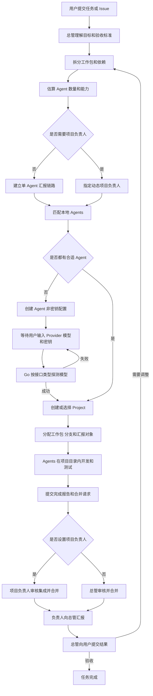
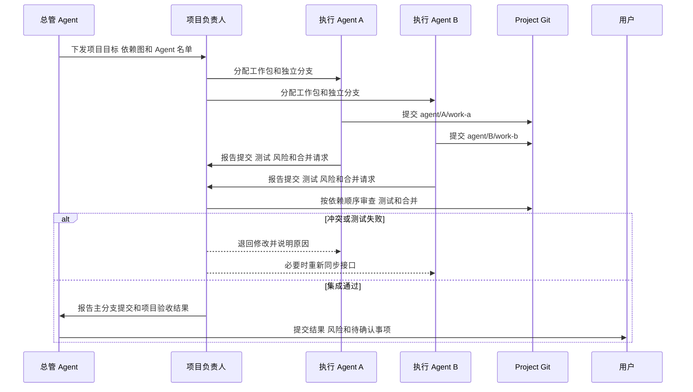
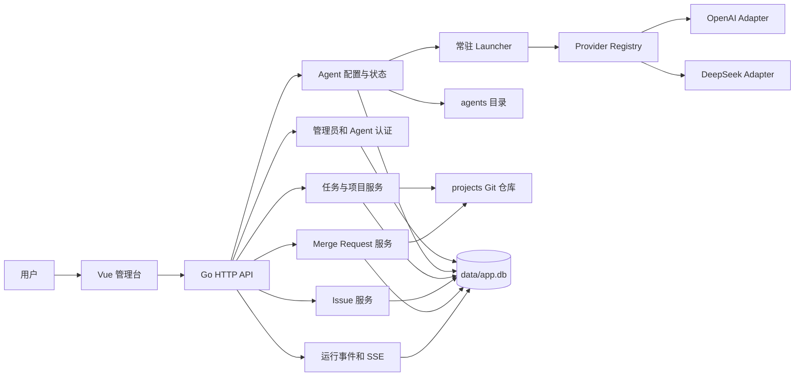

# Wanxiang Agent 应用逻辑与协作规范

> 文档状态：架构入口文档
> 适用对象：用户、总管 Agent、项目负责人 Agent、执行 Agent、后续维护者
> 最后更新：2026-07-14

## 1. 文档用途

Wanxiang Agent 是一个本地多 Agent 调度平台。用户提交任务或 Issue 后，总管 Agent 负责理解需求、拆分工作、估算所需人数、匹配或创建 Agent、建立项目、组织 Git 协作，并汇总最终结果。

本文档只定义平台必须遵守的产品逻辑、角色职责、权限边界、数据流和恢复协议，不记录功能完成状态。实现状态、缺口、提交和测试证据统一记录在 `wanxiangAgentWorkMission.md`。

后续 Agent 开始工作前应先阅读本文档，再阅读 `wanxiangAgentWorkMission.md` 和任务相关源码。规范描述的是验收目标，是否已经实现以 Mission 文档中的状态和证据为准。

用户可以直接修改本文档。总管 Agent 可以在用户授权的任务中修改本文档，但必须说明修改原因并提交 Git 记录。执行 Agent 只能在被分配的项目目录中修改项目文档，不能修改本文件。

## 2. 产品定位

Wanxiang Agent 解决四个问题：

1. 将用户的一段自然语言需求转成可执行的工作包和依赖关系。
2. 根据模型、Skill、MCP、专业能力和当前负载选择合适的 Agent。
3. 为多个 Agent 提供隔离的项目目录、Git 分支、汇报链路和合并规则。
4. 将缺少密钥、模型、人员、权限、测试结果或人工判断等阻塞暴露给用户。

平台不把“Agent 在线”视为“Agent 可以完成任务”。Agent 只有同时满足模型接口可用、能力符合、权限足够且当前可调度时，才可以接收工作。

## 3. 核心角色

### 3.1 用户

用户拥有最高决策权：

- 发布任务或 Issue。
- 输入和替换 Agent 的模型、API 地址及密钥。
- 确认高风险操作、调整团队规模、指定或更换负责人。
- 查看进度、阻塞、分支、测试结果和最终交付物。
- 覆盖总管的调度决定。
- 修改本文档和平台规则。

任何 Agent 都不能在日志、事件、接口响应、Git 提交或文档中回显用户密钥。

### 3.2 总管 Agent

总管 Agent 是平台级调度者，负责：

- 理解任务目标、约束、验收标准和风险。
- 判断是新建项目、复用已有项目，还是修改 Wanxiang Agent 自身。
- 拆分工作包，建立依赖关系，估算并发度和所需 Agent 数量。
- 判断项目是否需要动态项目负责人。
- 根据 Agent 的模型、Skill、MCP、专业能力、记忆和负载匹配人员。
- 没有合适 Agent 时创建 Agent 定义，并请求用户配置模型和密钥。
- 决定每个 Agent 的项目、分支、任务范围、汇报对象和验收条件。
- 汇总项目负责人的报告，向用户说明结果、风险和下一步。

总管是唯一可以在授权范围内修改 Wanxiang Agent 平台源码和非密钥 Agent 配置的 AI 角色。总管修改平台自身时也必须使用 Git 分支、运行测试并留下提交记录。涉及认证、密钥、权限、数据库迁移、部署或删除数据的改动，需要用户确认后才能合并或执行。

### 3.3 动态项目负责人 Agent

项目负责人不是每个项目的固定角色。总管在确定项目方案时决定是否需要负责人。

满足以下任一条件时，通常需要项目负责人：

- 两个或更多 Agent 会修改同一个项目。
- 工作包共享接口、数据库结构、公共组件或发布流程。
- 多个分支存在明显的合并顺序或冲突风险。
- 项目需要统一架构决策、集成测试或发布验收。
- 任务风险高，需要独立于执行者的复核。

团队规模可以作为辅助判断：2 至 3 个并行 Agent 可以由一名执行 Agent 兼任负责人；4 个以上 Agent，或存在跨模块、高风险、复杂合并依赖时，应设置专职负责人。总管仍需根据真实依赖判断，不能只按人数套规则。

项目负责人负责：

- 接收总管给出的项目目标、Agent 名单和依赖图。
- 细化项目内的接口约定、分支顺序和集成检查。
- 接收执行 Agent 的完成报告和合并请求。
- 审核代码、测试、文档、风险和冲突。
- 将合格分支合入项目主分支。
- 向总管报告项目整体状态，不代替用户做高风险决定。

项目只有一个主要负责人。总管可以指定候补负责人，但必须在项目元数据中记录切换原因。

### 3.4 执行 Agent

执行 Agent 完成被分配的工作包，例如后端、前端、测试、文档、安全审查或部署检查。

执行 Agent 必须：

- 只修改分配给自己的 `projects/<project>/` 项目范围。
- 多人协作时使用独立分支，不能直接修改项目 `main`。
- 遵守任务说明、项目规范、Skill 和 MCP 权限。
- 提交代码、测试结果、变更摘要、风险和待处理事项。
- 按总管指定的汇报对象报告，不得绕过项目负责人直接请求合并。

执行 Agent 不能修改 Wanxiang Agent 平台源码、其他 Agent 的目录、其他项目、用户密钥或平台部署配置。

## 4. 权限边界

| 资源或操作                 | 用户               | 总管 Agent         | 项目负责人       | 执行 Agent               |
| -------------------------- | ------------------ | ------------------ | ---------------- | ------------------------ |
| 修改`wanxiang/` 平台源码 | 允许               | 用户授权后允许     | 禁止             | 禁止                     |
| 修改`wanxiangAgent.md`   | 允许               | 用户授权后允许     | 禁止             | 禁止                     |
| 创建 Agent 非密钥配置      | 允许               | 允许               | 仅可提出申请     | 禁止                     |
| 输入或替换 API 密钥        | 允许               | 只能请求用户输入   | 禁止             | 禁止                     |
| 读取明文 API 密钥          | 不通过应用接口回显 | 禁止               | 禁止             | 只能由运行时注入自身密钥 |
| 创建`projects/<project>` | 允许               | 允许               | 禁止自行扩展范围 | 禁止                     |
| 修改已分配项目             | 允许               | 允许               | 允许             | 仅限自己的任务和分支     |
| 修改其他项目               | 允许               | 经任务授权允许     | 禁止             | 禁止                     |
| 合并单 Agent 项目分支      | 允许               | 允许               | 不适用           | 禁止                     |
| 合并多人项目分支           | 允许               | 可接管             | 允许             | 禁止                     |
| 执行部署、删库、删除项目   | 允许               | 必须先取得用户确认 | 禁止             | 禁止                     |

权限判断必须由 Go 服务、文件路径校验、Agent 身份和 Git 操作共同执行，不能只依赖提示词约束。

## 5. Agent 的能力描述

每个 Agent 在 `agents/<name>/` 下拥有独立定义。调度需要综合以下信息：

- `role`：职责，例如 manager、project-lead、backend、frontend、qa。
- `capabilities`：可以承担的工作类型。
- `model`：Provider、模型名称、接口地址和是否已配置密钥。
- `skills/`：可复用的专业工作流程。
- `mcps/`：可以访问的工具和外部系统。
- `memory/`：项目经验、决策和任务摘要。
- 当前状态：online、busy、blocked、offline。
- 当前任务、并发上限、历史质量和成本约束。

模型、Skill 或 MCP 任一项不满足任务的硬性要求时，不能只因为 Agent 空闲就把任务分配给它。

### 5.1 模型接口配置

每个 Agent 的私密配置保存在 `agents/<name>/env`：

```dotenv
AGENT_PROVIDER_TYPE=openai
AGENT_API_KEY=
AGENT_BASE_URL=https://api.openai.com/v1
AGENT_MODEL=
```

当前支持 `openai` 和 `deepseek` 两种接口类型。Go 服务根据 `AGENT_PROVIDER_TYPE` 选择独立 Provider 适配器。保存配置或服务启动时会执行一次最小真实请求；探测成功后 Agent 才进入 `online`。

`env` 权限必须是 `0600`，并由 Git 忽略。用户编辑已有 Agent 时留空密钥，后端保留原密钥。

## 6. 总管如何确定团队

### 6.1 分析需求

总管先回答以下问题：

1. 任务属于平台自身还是某个业务项目？
2. 是否已有可复用项目？
3. 有哪些可以独立验收的工作包？
4. 工作包之间有哪些依赖和共享接口？
5. 哪些工作可以并行，哪些必须串行？
6. 需要哪些模型能力、Skill、MCP 和文件权限？
7. 是否需要项目负责人、审查者或专门测试 Agent？

总管按可独立交付的工作包估算 Agent 数量，不能简单地按技术栈数量分配人员。两个高度耦合的小工作包可以交给同一个 Agent；一个高风险工作包可以增加独立审查 Agent。

### 6.2 判断是否需要项目负责人

- 单 Agent、低风险、独立项目：不设项目负责人，执行 Agent 向总管报告。
- 多 Agent、共享代码或需要集成：设置项目负责人，执行 Agent 向负责人报告。
- 总管修改平台自身：总管负责协调，但高风险合并由用户确认。

### 6.3 匹配已有 Agent

匹配分成两层：

**硬性条件**

- Agent 状态可用，模型接口探测成功。
- 模型能力满足任务要求。
- 所需 Skill 和 MCP 已安装并获授权。
- Agent 对目标项目有写权限。
- Agent 没有超过并发上限。

**排序条件**

- 与项目或技术领域相关的历史记忆。
- 近期任务质量、测试通过率和返工次数。
- 当前负载、响应速度、模型成本和上下文容量。
- 与其他候选 Agent 的能力互补程度。

总管应记录选择理由，方便用户调整。

### 6.4 没有合适 Agent

总管执行以下流程：

1. 创建新的 `agents/<name>/` 非密钥配置、角色、能力、Skill 和 MCP 需求。
2. 将 Agent 标记为 `blocked: missing_config`。
3. 向用户展示所需 Provider、建议模型、默认接口地址和缺失密钥。
4. 用户在管理页面输入模型和密钥。
5. Go 服务根据接口类型调用对应 Provider 做真实探测。
6. 探测成功后 Agent 进入 `online`，调度流程继续。
7. 探测失败时保留错误摘要，但不记录或返回密钥。

总管不能替用户生成、猜测、复制或从其他 Agent 借用密钥。

## 7. 项目创建与元数据

总管为任务选择或创建 `projects/<project>/`。新项目必须是独立 Git 仓库，并包含 `.wanxiang/` 元数据。

项目结构：

```text
projects/<project>/
├── .git/
├── .wanxiang/
│   ├── project.yaml
│   ├── task.yaml
│   ├── assignments/
│   ├── merge_requests/
│   ├── test_reports/
│   └── manager_reviews/
└── 项目代码
```

`project.yaml` 至少记录：

```yaml
project: example-project
manager: manager
project_lead: backend-lead # 单 Agent 项目可以为空
agents:
  - name: backend-dev
    reports_to: backend-lead
  - name: frontend-dev
    reports_to: backend-lead
branch_policy: agent/<agent>/<work-item>
merge_target: main
```

## 8. 完整调度流程



## 9. Git 分支、汇报与合并

### 9.1 分支规则

- 项目默认主分支为 `main`。
- 多 Agent 不得共享开发分支。
- 多 Agent 同时开发时，应为每个 Agent 创建独立分支和独立 Git worktree，不能在同一目录反复切换分支。
- 建议分支名：`agent/<agent-name>/<work-item>`。
- Agent 开始工作前应确认工作区干净，并记录起始提交。
- 每个提交只包含该工作包相关修改。
- Agent 不得强推、删除其他 Agent 分支或绕过合并审查。

### 9.2 完成报告格式

执行 Agent 完成工作后必须提交：

- Agent 名称、任务 ID、项目和分支。
- 完成的工作和未完成事项。
- 关键文件与提交哈希。
- 执行过的测试命令及结果。
- 数据迁移、兼容性、安全或部署风险。
- 建议合并顺序和依赖分支。
- 是否需要用户决策。

### 9.3 汇报对象

- 单 Agent 项目：执行 Agent 向总管报告并请求合并。
- 多 Agent 项目：执行 Agent 向项目负责人报告并请求合并。
- 项目负责人完成集成后向总管报告。
- 总管整理业务结果、风险和用户需要确认的事项后向用户报告。

执行 Agent 只有在项目负责人失联、被阻塞或总管明确改派时，才能越级向总管报告。越级原因必须写入事件和任务记录。

### 9.4 多 Agent 合并流程



MR 服务必须执行本地分支检查、干净工作区检查、`--no-ff` 合并、冲突后 abort、阻塞 Issue 检查和事件记录。单 Agent 项目由总管合并，多 Agent 项目由项目负责人审核和合并；总管可以按权限规则接管。

## 10. 系统组件关系



## 11. 规范目录与组件职责

```text
wanxiang/
├── wanxiangAgent.md              # 本文档，应用逻辑和协作规范
├── README.md                     # 开发、部署和 Provider 配置
├── agents/                       # 每个 Agent 的本地定义与私密运行目录
│   └── manager/
│       ├── agent.yaml            # 角色、能力、模型环境变量映射
│       ├── env.example           # 无密钥示例
│       ├── env                   # 私密配置，0600，不进入 Git
│       ├── system_prompt.md
│       ├── skills/
│       ├── mcps/
│       ├── memory/
│       └── logs/
├── data/
│   └── app.db                    # SQLite 运行状态，不进入 Git
├── projects/                     # 总管创建和分配的独立项目仓库
│   └── <project>/
│       ├── .git/
│       ├── .wanxiang/
│       └── 项目代码
├── server/
│   ├── cmd/wanxiang/             # Go 服务入口
│   └── internal/
│       ├── agents/               # Agent 配置、探测、心跳、记忆和日志
│       ├── app/                  # 依赖装配和生命周期
│       ├── auth/                 # 密码、令牌和哈希
│       ├── config/               # 根目录、端口和远程地址
│       ├── db/                   # SQLite 连接和表结构
│       ├── events/               # 持久事件与 SSE
│       ├── files/                # 根目录与符号链接安全检查
│       ├── gitx/                 # 受工作目录约束的 Git 命令
│       ├── httpapi/              # 管理员和 Agent HTTP API
│       ├── issues/               # 阻塞及普通 Issue
│       ├── mr/                   # MR 创建、检查和本地合并
│       ├── providers/            # OpenAI 与 DeepSeek 适配器
│       ├── tasks/                # 任务、Project 和 Git 初始化
│       └── testutil/             # 后端测试辅助
├── web/
│   └── src/
│       ├── api/                  # HTTP 客户端和类型
│       ├── components/           # 工作流和 Agent 输出组件
│       ├── stores/               # 登录与事件状态
│       ├── views/                # 登录、调度台、Agents、任务、MR、Issue
│       ├── router.ts
│       └── main.ts
├── deploy/
│   ├── pm2/                      # 当前生产进程配置
│   ├── systemd/                  # Linux systemd 示例
│   ├── nginx/                    # Nginx 示例，线上由宝塔管理
│   └── windows/                  # Windows 服务说明
└── docs/superpowers/             # 设计和实施计划记录
```

## 12. 平台能力规范

平台必须提供以下能力，具体实现顺序和完成证据由 `wanxiangAgentWorkMission.md` 管理：

- 总管调用模型持续消费任务并形成自动规划循环。
- 总管从模型、Skill、MCP、记忆、权限和负载生成可解释的 Agent 匹配评分。
- 总管按工作包依赖自动估算 Agent 数量和并发计划。
- 平台记录动态项目负责人的选择、替换原因和权限。
- 平台按任务需要生成完整 Agent 目录、Skill 和 MCP 配置，但只允许用户输入密钥。
- 用户补齐配置后，调度器自动恢复对应的阻塞任务。
- 项目持久化 assignments、依赖图、汇报对象、分支和 worktree。
- 平台为每个执行 Agent 创建独立分支和 worktree，并在操作系统与服务层限制写入范围。
- 项目负责人审核和合并多人项目；总管审核单 Agent 项目并可按规则接管。
- 总管修改平台源码时使用专用安全工作流、独立分支、测试和提交记录。
- 平台编排集成测试、有限重试、回滚和经过用户确认的发布。
- 管理台通过查询 API 获取任务、项目、Agent、MR、Issue、检查点和事件。
- Go 服务执行 `agent_tokens.scopes`，限制 Agent 只能访问获授权的项目、工作包和接口。
- 平台按第 14 节协议恢复中断任务并防止旧租约继续写入。

## 13. 状态和阻塞规则

建议统一以下状态：

**Agent**

```text
missing_config -> configured -> probing -> online -> busy
                         \-> blocked: provider_error
online/busy -> blocked: permission | blocked: dependency | offline
```

**工作包**

```text
created -> assigned -> in_progress -> review -> merged -> completed
                       \-> blocked -> in_progress
review -> changes_requested -> in_progress
```

出现以下情况时必须停止自动执行并通知用户：

- 需要新增或替换密钥。
- 需要扩大文件、项目、MCP 或外部系统权限。
- 需要执行不可逆的数据删除或生产部署。
- 总管和项目负责人对高风险方案存在冲突。
- 合并测试失败且连续修复未解决。
- 工作范围超出用户原始任务。

## 14. Agent 断点续接

平台使用“数据库任务状态 + Git checkpoint + 简短上下文摘要”恢复中断的工作。数据库记录谁有权继续执行，Git 保存可复现的代码状态，上下文摘要告诉恢复者下一步做什么。模型聊天记录不能作为唯一恢复依据。

### 14.1 恢复目标

Agent 进程退出、网络断开、Provider 暂时不可用或服务重启后，平台应做到：

- 保留已经完成并验证的代码和任务步骤。
- 阻止原 Agent 与接替 Agent 同时修改同一个工作包。
- 原 Agent 恢复在线后从最近一个有效检查点继续。
- 原 Agent 无法及时返回时，由总管把工作包安全转交给其他 Agent。
- 向用户展示中断时间、恢复来源、代码基线和剩余工作。

### 14.2 数据库任务状态和租约

每个 `task_step` 需要持久化以下恢复字段：

| 字段                  | 用途                                                                                                                                |
| --------------------- | ----------------------------------------------------------------------------------------------------------------------------------- |
| `status`            | `created`、`assigned`、`in_progress`、`checkpointed`、`interrupted`、`review`、`merged`、`completed` 或 `blocked` |
| `assigned_agent`    | 当前有权执行该工作包的 Agent                                                                                                        |
| `lease_id`          | 每次分配生成的新租约标识                                                                                                            |
| `lease_version`     | 接管时递增，拒绝旧执行者继续写入                                                                                                    |
| `lease_expires_at`  | 心跳超过该时间后允许总管判定中断                                                                                                    |
| `last_heartbeat_at` | Agent 最近一次任务级心跳                                                                                                            |
| `checkpoint_id`     | 最近一个已确认检查点                                                                                                                |
| `attempt`           | 当前工作包被恢复或接管的次数                                                                                                        |
| `interrupted_at`    | 本轮中断时间                                                                                                                        |
| `resume_deadline`   | 等待原 Agent 自动恢复的截止时间                                                                                                     |

Agent 调用任务写接口时必须同时提交 `task_id`、`step_id`、`agent_name`、`lease_id` 和 `lease_version`。Go 服务校验租约后才允许更新状态、事件、报告或 MR。心跳不能只更新 Agent 在线状态，还要续期当前工作包租约。

推荐默认值：任务级心跳每 15 秒一次；连续 60 秒没有心跳时标记 `interrupted`；再等待 5 分钟让原 Agent 恢复。高风险任务可以由总管或用户延长等待时间。平台重启后由恢复扫描器重新计算租约，不能因为进程重启立即重复分配任务。

### 14.3 Git checkpoint

每个执行 Agent 使用独立分支和 worktree。分支格式保持 `agent/<agent-name>/<work-item>`。Agent 在以下时机创建 checkpoint：

- 完成一个可独立验证的步骤后。
- 修改公共接口、数据库结构或依赖版本前。
- 开始预计耗时较长的测试或外部操作前。
- 收到关闭、重启或租约即将到期信号时。

检查点优先使用正常 Git 提交，提交信息格式为 `checkpoint(<step-id>): <summary>`。检查点提交必须保持项目可解析；能运行的局部测试应当通过。无法形成安全提交时，Agent 写入上下文摘要并保留 worktree，平台不得自动执行 `reset`、`clean` 或删除该 worktree。

平台为每个检查点记录：

- 项目、任务、工作包和 Agent。
- 分支、worktree 路径、起始提交和 checkpoint 提交。
- 工作区是否干净及未提交文件清单。
- 已执行的测试命令和结果。
- 是否包含迁移、密钥、部署或不可逆操作。

接替 Agent 默认从最近一个干净 checkpoint 创建 `agent/<new-agent>/<work-item>-resume-<attempt>` 分支。若原 worktree 含未提交修改，总管先把该状态标记为需要恢复审查，不能让两个 Agent 共用同一个 worktree。

### 14.4 简短上下文摘要

每次 checkpoint 和正常退出前，Agent 写入结构化摘要。摘要保存在数据库，并同步到项目目录：

```text
.wanxiang/checkpoints/<step-id>/<checkpoint-id>.yaml
```

摘要至少包含：

```yaml
task_id: 12
step_id: 34
agent: backend-dev
lease_version: 2
branch: agent/backend-dev/auth-api
worktree: /absolute/project/worktree/path
base_commit: abc1234
checkpoint_commit: def5678
completed:
  - 已增加登录请求校验
next_action: 增加过期会话测试
files_changed:
  - server/internal/auth/session.go
tests:
  - command: go test ./internal/auth
    result: passed
decisions:
  - 会话过期时间由服务端计算
blockers: []
risks:
  - 尚未执行完整后端测试
```

摘要只记录恢复工作需要的信息。Agent 不能写入 API 密钥、访问令牌、完整模型对话、用户隐私或无关日志。`next_action` 必须是一项可以立即执行的动作。

### 14.5 原 Agent 重连流程

1. Agent 使用自身令牌重新注册并报告当前 `task_id`、`step_id`、`lease_id` 和 `lease_version`。
2. Go 服务检查工作包仍处于 `interrupted`，且没有新 Agent 获得更高版本租约。
3. 恢复器校验项目路径、worktree、分支、HEAD、checkpoint 提交和工作区状态。
4. Agent 读取 `task.yaml`、`project.yaml`、assignment、最近检查点摘要和检查点之后的事件。
5. Agent 先运行摘要中最近一条通过的最小验证命令，确认代码基线仍然有效。
6. Go 服务恢复租约，把状态改回 `in_progress`，发布 `task.step.resumed` 事件。
7. Agent 从 `next_action` 继续，并在下一次 checkpoint 更新摘要。

任何校验失败都不能自动覆盖文件。Agent 创建阻塞 Issue，记录期望提交、实际提交、工作区差异和需要用户或总管决定的事项。

### 14.6 超时接管流程

原 Agent 超过 `resume_deadline` 仍未恢复时，总管执行接管：

1. 将旧租约标记为 `revoked`，递增 `lease_version`。
2. 选择满足任务能力、权限和负载要求的新 Agent。
3. 读取最近一个有效 checkpoint 和上下文摘要。
4. 从 checkpoint 提交创建新的接力分支和独立 worktree。
5. 运行摘要中的基线测试；失败时先创建阻塞 Issue，不继续修改代码。
6. 写入新的 assignment、接管原因、旧 Agent、新 Agent 和分支关系。
7. 发布 `task.step.reassigned` 事件并继续工作。

旧 Agent 之后重新上线时只能读取原工作包和提交恢复报告。除非总管再次分配，否则旧租约不能写任务状态、项目文件或 MR。

### 14.7 幂等和并发保护

- 所有状态更新使用 `step_id + lease_version + expected_status` 做条件更新。
- checkpoint 请求携带幂等键；重复请求返回原 checkpoint，不创建重复提交或事件。
- 同一个工作包同时只能有一个有效写租约。
- MR 创建和合并前校验分支属于当前租约或已经进入审核状态的已撤销租约。
- 任务恢复、重新分配、检查点失败和租约冲突写入 `runtime_events` 与 `audit_logs`。
- `agent_tokens.scopes` 必须限制 Agent 只能操作被分配的项目、工作包和接口。

### 14.8 用户界面和人工控制

任务详情页需要展示 Agent 最近心跳、租约剩余时间、checkpoint 提交、上下文摘要、中断原因和恢复次数。用户可以执行：

- 延长原 Agent 的恢复等待时间。
- 立即让总管重新分配。
- 指定接替 Agent。
- 冻结工作包，禁止任何 Agent 继续写入。
- 选择从某个历史 checkpoint 重新开始。

重新分配、跳过 checkpoint 或恢复含未提交修改的 worktree 属于高风险操作，界面必须展示影响范围并要求用户确认。

### 14.9 恢复功能验收条件

- Agent 在工作中断后能从最近 checkpoint 恢复，已完成步骤不会重复执行。
- 旧 Agent 使用过期租约写入时收到明确的租约冲突错误。
- 服务重启不会丢失 assignment、checkpoint、摘要或恢复期限。
- 接替 Agent 使用独立分支和 worktree，不修改原 Agent 的现场。
- checkpoint 基线测试失败时停止恢复并创建阻塞 Issue。
- API、事件、日志和 Git 提交不包含密钥。
- 用户能在管理台查看中断、恢复和接管的完整时间线。

具体实施顺序和当前完成状态记录在根目录 `wanxiangAgentWorkMission.md`。后续 AI 开始实现前必须先读取该文件，并在完成每个 Mission 后更新其中的证据和状态。

## 15. 给后续 Agent 的阅读顺序

1. 阅读本文档，确认角色、权限、汇报对象和验收规范。
2. 阅读 `wanxiangAgentWorkMission.md`，选择依赖已经完成的下一个 Mission，并记录开始状态。
3. 阅读 `README.md`，了解启动、部署和模型配置。
4. 阅读 `server/internal/app/app.go` 和 `httpapi/router.go`，建立运行链路。
5. 按任务进入对应领域目录，例如 `agents/`、`tasks/`、`mr/` 或 `providers/`。
6. 查看相关测试，确认真实约束和错误处理。
7. 检查 Git 状态，保留不属于当前任务的用户改动。
8. 执行 Agent 进入 `projects/<project>` 后再次读取项目内说明和 `.wanxiang/` 元数据。

## 16. 文档维护规则

- 用户可以直接修改任何规则，用户的新指令优先。
- 总管修改本文档时只记录规则变化；实现进度和代码证据写入 `wanxiangAgentWorkMission.md`。
- 新功能上线后，执行者更新对应 Mission 的状态、提交、测试证据和剩余风险，不在本文档增加完成状态。
- 权限、密钥、合并规则和部署行为发生变化时，必须同步更新流程图和权限矩阵。
- 不在本文档中记录真实密钥、令牌、用户隐私或内部服务凭据。
- 每次修改通过 Git 提交保留原因，方便其他 Agent 追溯设计演变。
- 每完成一个 Mission，执行者必须更新 `wanxiangAgentWorkMission.md` 中的状态、提交、测试证据、剩余风险和下一步。
