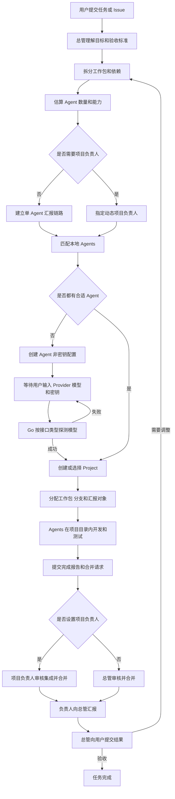
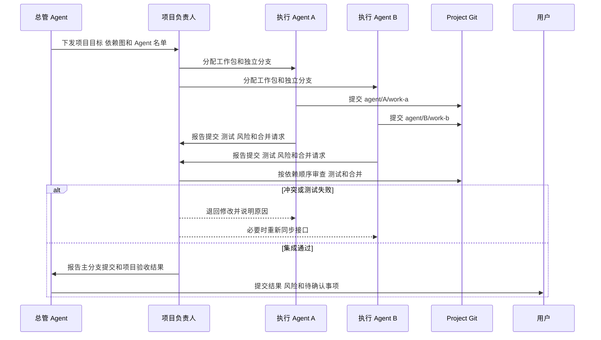
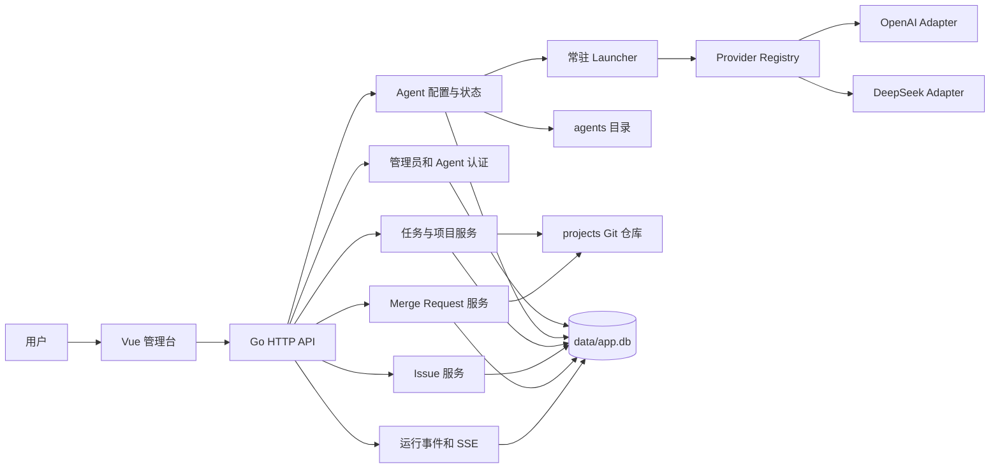

# Wanxiang Agent 应用逻辑与协作规范

> 文档状态：架构入口文档
> 适用对象：用户、总管 Agent、项目负责人 Agent、执行 Agent、后续维护者
> 最后更新：2026-07-14

## 1. 文档用途

Wanxiang Agent 是一个本地多 Agent 调度平台。用户提交任务或 Issue 后，总管 Agent 负责理解需求、拆分工作、估算所需人数、匹配或创建 Agent、建立项目、组织 Git 协作，并汇总最终结果。

本文档同时记录两类信息：

- **已实现**：当前仓库已有代码可以完成的行为。
- **目标规则**：平台后续实现必须遵守的产品逻辑和权限边界。

后续 Agent 开始工作前应先阅读本文档，再阅读与任务相关的源码。不能把“目标规则”描述的能力当成当前已经上线的功能。

用户可以直接修改本文档。总管 Agent 可以在用户授权的任务中修改本文档，但必须说明修改原因并提交 Git 记录。执行 Agent 只能在被分配的项目目录中修改项目文档，不能修改本文件。

## 2. 产品定位

Wanxiang Agent 解决四个问题：

1. 将用户的一段自然语言需求转成可执行的工作包和依赖关系。
2. 根据模型、Skill、MCP、专业能力和当前负载选择合适的 Agent。
3. 为多个 Agent 提供隔离的项目目录、Git 分支、汇报链路和合并规则。
4. 将缺少密钥、模型、人员、权限、测试结果或人工判断等阻塞暴露给用户。

平台不把“Agent 在线”视为“Agent 可以完成任务”。Agent 只有同时满足模型接口可用、能力符合、权限足够且当前可调度时，才可以接收工作。

## 3. 核心角色

### 3.1 用户

用户拥有最高决策权：

- 发布任务或 Issue。
- 输入和替换 Agent 的模型、API 地址及密钥。
- 确认高风险操作、调整团队规模、指定或更换负责人。
- 查看进度、阻塞、分支、测试结果和最终交付物。
- 覆盖总管的调度决定。
- 修改本文档和平台规则。

任何 Agent 都不能在日志、事件、接口响应、Git 提交或文档中回显用户密钥。

### 3.2 总管 Agent

总管 Agent 是平台级调度者，负责：

- 理解任务目标、约束、验收标准和风险。
- 判断是新建项目、复用已有项目，还是修改 Wanxiang Agent 自身。
- 拆分工作包，建立依赖关系，估算并发度和所需 Agent 数量。
- 判断项目是否需要动态项目负责人。
- 根据 Agent 的模型、Skill、MCP、专业能力、记忆和负载匹配人员。
- 没有合适 Agent 时创建 Agent 定义，并请求用户配置模型和密钥。
- 决定每个 Agent 的项目、分支、任务范围、汇报对象和验收条件。
- 汇总项目负责人的报告，向用户说明结果、风险和下一步。

总管是唯一可以在授权范围内修改 Wanxiang Agent 平台源码和非密钥 Agent 配置的 AI 角色。总管修改平台自身时也必须使用 Git 分支、运行测试并留下提交记录。涉及认证、密钥、权限、数据库迁移、部署或删除数据的改动，需要用户确认后才能合并或执行。

### 3.3 动态项目负责人 Agent

项目负责人不是每个项目的固定角色。总管在确定项目方案时决定是否需要负责人。

满足以下任一条件时，通常需要项目负责人：

- 两个或更多 Agent 会修改同一个项目。
- 工作包共享接口、数据库结构、公共组件或发布流程。
- 多个分支存在明显的合并顺序或冲突风险。
- 项目需要统一架构决策、集成测试或发布验收。
- 任务风险高，需要独立于执行者的复核。

团队规模可以作为辅助判断：2 至 3 个并行 Agent 可以由一名执行 Agent 兼任负责人；4 个以上 Agent，或存在跨模块、高风险、复杂合并依赖时，应设置专职负责人。总管仍需根据真实依赖判断，不能只按人数套规则。

项目负责人负责：

- 接收总管给出的项目目标、Agent 名单和依赖图。
- 细化项目内的接口约定、分支顺序和集成检查。
- 接收执行 Agent 的完成报告和合并请求。
- 审核代码、测试、文档、风险和冲突。
- 将合格分支合入项目主分支。
- 向总管报告项目整体状态，不代替用户做高风险决定。

项目只有一个主要负责人。总管可以指定候补负责人，但必须在项目元数据中记录切换原因。

### 3.4 执行 Agent

执行 Agent 完成被分配的工作包，例如后端、前端、测试、文档、安全审查或部署检查。

执行 Agent 必须：

- 只修改分配给自己的 `projects/<project>/` 项目范围。
- 多人协作时使用独立分支，不能直接修改项目 `main`。
- 遵守任务说明、项目规范、Skill 和 MCP 权限。
- 提交代码、测试结果、变更摘要、风险和待处理事项。
- 按总管指定的汇报对象报告，不得绕过项目负责人直接请求合并。

执行 Agent 不能修改 Wanxiang Agent 平台源码、其他 Agent 的目录、其他项目、用户密钥或平台部署配置。

## 4. 权限边界

| 资源或操作                 | 用户               | 总管 Agent         | 项目负责人       | 执行 Agent               |
| -------------------------- | ------------------ | ------------------ | ---------------- | ------------------------ |
| 修改`wanxiang/` 平台源码 | 允许               | 用户授权后允许     | 禁止             | 禁止                     |
| 修改`wanxiangAgent.md`   | 允许               | 用户授权后允许     | 禁止             | 禁止                     |
| 创建 Agent 非密钥配置      | 允许               | 允许               | 仅可提出申请     | 禁止                     |
| 输入或替换 API 密钥        | 允许               | 只能请求用户输入   | 禁止             | 禁止                     |
| 读取明文 API 密钥          | 不通过应用接口回显 | 禁止               | 禁止             | 只能由运行时注入自身密钥 |
| 创建`projects/<project>` | 允许               | 允许               | 禁止自行扩展范围 | 禁止                     |
| 修改已分配项目             | 允许               | 允许               | 允许             | 仅限自己的任务和分支     |
| 修改其他项目               | 允许               | 经任务授权允许     | 禁止             | 禁止                     |
| 合并单 Agent 项目分支      | 允许               | 允许               | 不适用           | 禁止                     |
| 合并多人项目分支           | 允许               | 可接管             | 允许             | 禁止                     |
| 执行部署、删库、删除项目   | 允许               | 必须先取得用户确认 | 禁止             | 禁止                     |

权限判断必须由 Go 服务、文件路径校验、Agent 身份和 Git 操作共同执行，不能只依赖提示词约束。

## 5. Agent 的能力描述

每个 Agent 在 `agents/<name>/` 下拥有独立定义。调度需要综合以下信息：

- `role`：职责，例如 manager、project-lead、backend、frontend、qa。
- `capabilities`：可以承担的工作类型。
- `model`：Provider、模型名称、接口地址和是否已配置密钥。
- `skills/`：可复用的专业工作流程。
- `mcps/`：可以访问的工具和外部系统。
- `memory/`：项目经验、决策和任务摘要。
- 当前状态：online、busy、blocked、offline。
- 当前任务、并发上限、历史质量和成本约束。

模型、Skill 或 MCP 任一项不满足任务的硬性要求时，不能只因为 Agent 空闲就把任务分配给它。

### 5.1 模型接口配置

每个 Agent 的私密配置保存在 `agents/<name>/env`：

```dotenv
AGENT_PROVIDER_TYPE=openai
AGENT_API_KEY=
AGENT_BASE_URL=https://api.openai.com/v1
AGENT_MODEL=
```

当前支持 `openai` 和 `deepseek` 两种接口类型。Go 服务根据 `AGENT_PROVIDER_TYPE` 选择独立 Provider 适配器。保存配置或服务启动时会执行一次最小真实请求；探测成功后 Agent 才进入 `online`。

`env` 权限必须是 `0600`，并由 Git 忽略。用户编辑已有 Agent 时留空密钥，后端保留原密钥。

## 6. 总管如何确定团队

### 6.1 分析需求

总管先回答以下问题：

1. 任务属于平台自身还是某个业务项目？
2. 是否已有可复用项目？
3. 有哪些可以独立验收的工作包？
4. 工作包之间有哪些依赖和共享接口？
5. 哪些工作可以并行，哪些必须串行？
6. 需要哪些模型能力、Skill、MCP 和文件权限？
7. 是否需要项目负责人、审查者或专门测试 Agent？

总管按可独立交付的工作包估算 Agent 数量，不能简单地按技术栈数量分配人员。两个高度耦合的小工作包可以交给同一个 Agent；一个高风险工作包可以增加独立审查 Agent。

### 6.2 判断是否需要项目负责人

- 单 Agent、低风险、独立项目：不设项目负责人，执行 Agent 向总管报告。
- 多 Agent、共享代码或需要集成：设置项目负责人，执行 Agent 向负责人报告。
- 总管修改平台自身：总管负责协调，但高风险合并由用户确认。

### 6.3 匹配已有 Agent

匹配分成两层：

**硬性条件**

- Agent 状态可用，模型接口探测成功。
- 模型能力满足任务要求。
- 所需 Skill 和 MCP 已安装并获授权。
- Agent 对目标项目有写权限。
- Agent 没有超过并发上限。

**排序条件**

- 与项目或技术领域相关的历史记忆。
- 近期任务质量、测试通过率和返工次数。
- 当前负载、响应速度、模型成本和上下文容量。
- 与其他候选 Agent 的能力互补程度。

总管应记录选择理由，方便用户调整。

### 6.4 没有合适 Agent

总管执行以下流程：

1. 创建新的 `agents/<name>/` 非密钥配置、角色、能力、Skill 和 MCP 需求。
2. 将 Agent 标记为 `blocked: missing_config`。
3. 向用户展示所需 Provider、建议模型、默认接口地址和缺失密钥。
4. 用户在管理页面输入模型和密钥。
5. Go 服务根据接口类型调用对应 Provider 做真实探测。
6. 探测成功后 Agent 进入 `online`，调度流程继续。
7. 探测失败时保留错误摘要，但不记录或返回密钥。

总管不能替用户生成、猜测、复制或从其他 Agent 借用密钥。

## 7. 项目创建与元数据

总管为任务选择或创建 `projects/<project>/`。新项目必须是独立 Git 仓库，并包含 `.wanxiang/` 元数据。

建议的目标结构：

```text
projects/<project>/
├── .git/
├── .wanxiang/
│   ├── project.yaml
│   ├── task.yaml
│   ├── assignments/
│   ├── merge_requests/
│   ├── test_reports/
│   └── manager_reviews/
└── 项目代码
```

`project.yaml` 至少记录：

```yaml
project: example-project
manager: manager
project_lead: backend-lead # 单 Agent 项目可以为空
agents:
  - name: backend-dev
    reports_to: backend-lead
  - name: frontend-dev
    reports_to: backend-lead
branch_policy: agent/<agent>/<work-item>
merge_target: main
```

当前 `CreateTask` 已能创建独立项目 Git 仓库、初始化 `main`、写入 `.wanxiang/task.yaml`，并创建合并请求、测试报告和总管审查目录。动态负责人、assignments 和 `project.yaml` 仍属于目标能力。

## 8. 完整调度流程



## 9. Git 分支、汇报与合并

### 9.1 分支规则

- 项目默认主分支为 `main`。
- 多 Agent 不得共享开发分支。
- 多 Agent 同时开发时，应为每个 Agent 创建独立分支和独立 Git worktree，不能在同一目录反复切换分支。
- 建议分支名：`agent/<agent-name>/<work-item>`。
- Agent 开始工作前应确认工作区干净，并记录起始提交。
- 每个提交只包含该工作包相关修改。
- Agent 不得强推、删除其他 Agent 分支或绕过合并审查。

### 9.2 完成报告格式

执行 Agent 完成工作后必须提交：

- Agent 名称、任务 ID、项目和分支。
- 完成的工作和未完成事项。
- 关键文件与提交哈希。
- 执行过的测试命令及结果。
- 数据迁移、兼容性、安全或部署风险。
- 建议合并顺序和依赖分支。
- 是否需要用户决策。

### 9.3 汇报对象

- 单 Agent 项目：执行 Agent 向总管报告并请求合并。
- 多 Agent 项目：执行 Agent 向项目负责人报告并请求合并。
- 项目负责人完成集成后向总管报告。
- 总管整理业务结果、风险和用户需要确认的事项后向用户报告。

执行 Agent 只有在项目负责人失联、被阻塞或总管明确改派时，才能越级向总管报告。越级原因必须写入事件和任务记录。

### 9.4 多 Agent 合并流程



当前 MR 服务已经具备本地分支检查、干净工作区检查、`--no-ff` 合并、冲突后 abort、阻塞 Issue 检查和事件记录。当前代码只允许身份为 `manager` 的 Agent 合并 `main`；动态项目负责人合并权限仍需后续实现。

## 10. 系统组件关系



## 11. 当前代码结构

```text
wanxiang/
├── wanxiangAgent.md              # 本文档，应用逻辑和协作规范
├── README.md                     # 开发、部署和 Provider 配置
├── agents/                       # 每个 Agent 的本地定义与私密运行目录
│   └── manager/
│       ├── agent.yaml            # 角色、能力、模型环境变量映射
│       ├── env.example           # 无密钥示例
│       ├── env                   # 私密配置，0600，不进入 Git
│       ├── system_prompt.md
│       ├── skills/
│       ├── mcps/
│       ├── memory/
│       └── logs/
├── data/
│   └── app.db                    # SQLite 运行状态，不进入 Git
├── projects/                     # 总管创建和分配的独立项目仓库
│   └── <project>/
│       ├── .git/
│       ├── .wanxiang/
│       └── 项目代码
├── server/
│   ├── cmd/wanxiang/             # Go 服务入口
│   └── internal/
│       ├── agents/               # Agent 配置、探测、心跳、记忆和日志
│       ├── app/                  # 依赖装配和生命周期
│       ├── auth/                 # 密码、令牌和哈希
│       ├── config/               # 根目录、端口和远程地址
│       ├── db/                   # SQLite 连接和表结构
│       ├── events/               # 持久事件与 SSE
│       ├── files/                # 根目录与符号链接安全检查
│       ├── gitx/                 # 受工作目录约束的 Git 命令
│       ├── httpapi/              # 管理员和 Agent HTTP API
│       ├── issues/               # 阻塞及普通 Issue
│       ├── mr/                   # MR 创建、检查和本地合并
│       ├── providers/            # OpenAI 与 DeepSeek 适配器
│       ├── tasks/                # 任务、Project 和 Git 初始化
│       └── testutil/             # 后端测试辅助
├── web/
│   └── src/
│       ├── api/                  # HTTP 客户端和类型
│       ├── components/           # 工作流和 Agent 输出组件
│       ├── stores/               # 登录与事件状态
│       ├── views/                # 登录、调度台、Agents、任务、MR、Issue
│       ├── router.ts
│       └── main.ts
├── deploy/
│   ├── pm2/                      # 当前生产进程配置
│   ├── systemd/                  # Linux systemd 示例
│   ├── nginx/                    # Nginx 示例，线上由宝塔管理
│   └── windows/                  # Windows 服务说明
└── docs/superpowers/             # 设计和实施计划记录
```

## 12. 当前已实现能力

| 能力                                   | 当前状态 | 代码位置                                                   |
| -------------------------------------- | -------- | ---------------------------------------------------------- |
| 管理员初始化、登录和会话               | 已实现   | `server/internal/httpapi/handlers_auth.go`、`auth/`    |
| Agent 令牌身份认证                     | 已实现   | `server/internal/httpapi/middleware.go`                  |
| OpenAI 与 DeepSeek Provider            | 已实现   | `server/internal/providers/`                             |
| 每个 Agent 独立模型和密钥              | 已实现   | `server/internal/agents/service.go`                      |
| 启动和保存配置时真实探测               | 已实现   | `server/internal/agents/launcher.go`、`service.go`     |
| Agent 心跳、Token 用量、记忆和日志接口 | 已实现   | `server/internal/agents/`、`handlers_agent_runtime.go` |
| 创建任务时初始化独立 Project Git 仓库  | 已实现   | `server/internal/tasks/service.go`                       |
| 创建 Issue 和阻塞合并                  | 已实现   | `server/internal/issues/`、`mr/`                       |
| 创建 MR、校验分支并本地合并            | 已实现   | `server/internal/mr/service.go`                          |
| 运行事件持久化和 SSE                   | 已实现   | `server/internal/events/`                                |
| Agent 模型管理页面                     | 已实现   | `web/src/views/Agents.vue`                               |

当前 Launcher 只执行模型探测和本地心跳，不会启动 Codex、CLI 或独立 Agent 进程，也不会持续消费任务。Provider 返回的探测内容目前不会进入规划流程。`agent.yaml`、`system_prompt.md`、`skills/` 和 `mcps/` 尚未被运行时读取执行。

当前 MR 后端具备创建和合并接口，前端也有页面雏形，但浏览器管理会话与 Agent API 的鉴权尚未打通，因此不能把管理台 MR 操作视为完整可用。普通 Agent 也没有通过后端写入项目代码或执行命令的接口。

## 13. 尚未实现的目标能力

以下能力是本文档定义的目标，不应被后续 Agent 描述为当前已完成：

- 总管调用模型持续消费任务并形成自动规划循环。
- 从模型、Skill、MCP、记忆和负载生成可解释的 Agent 匹配评分。
- 自动估算 Agent 数量和并发计划。
- 动态项目负责人字段、选举、替换及权限。
- 自动生成完整 Agent 目录、Skill 和 MCP 配置。
- 用户配置完成后自动恢复被阻塞的调度流程。
- 项目级 assignments、依赖图和汇报对象持久化。
- 为每个执行 Agent 创建分支或 worktree，并在操作系统层限制写入范围。
- 项目负责人审核和合并权限；当前只有 manager 可以合并 `main`。
- 总管修改平台自身代码的专用安全工作流。
- 自动集成测试、失败重试、回滚和发布编排。
- 完整的任务、项目、Agent、MR 和 Issue 查询列表 API。
- 对 `agent_tokens.scopes` 的细粒度权限执行。

## 14. 状态和阻塞规则

建议统一以下状态：

**Agent**

```text
missing_config -> configured -> probing -> online -> busy
                         \-> blocked: provider_error
online/busy -> blocked: permission | blocked: dependency | offline
```

**工作包**

```text
created -> assigned -> in_progress -> review -> merged -> completed
                       \-> blocked -> in_progress
review -> changes_requested -> in_progress
```

出现以下情况时必须停止自动执行并通知用户：

- 需要新增或替换密钥。
- 需要扩大文件、项目、MCP 或外部系统权限。
- 需要执行不可逆的数据删除或生产部署。
- 总管和项目负责人对高风险方案存在冲突。
- 合并测试失败且连续修复未解决。
- 工作范围超出用户原始任务。

## 15. 给后续 Agent 的阅读顺序

1. 阅读本文档，确认角色、权限、汇报对象和“已实现/目标”边界。
2. 阅读 `README.md`，了解启动、部署和模型配置。
3. 阅读 `server/internal/app/app.go` 和 `httpapi/router.go`，建立运行链路。
4. 按任务进入对应领域目录，例如 `agents/`、`tasks/`、`mr/` 或 `providers/`。
5. 查看相关测试，确认真实约束和错误处理。
6. 检查 Git 状态，保留不属于当前任务的用户改动。
7. 执行 Agent 进入 `projects/<project>` 后再次读取项目内说明和 `.wanxiang/` 元数据。

## 16. 文档维护规则

- 用户可以直接修改任何规则，用户的新指令优先。
- 总管修改本文档时必须把“当前实现变化”和“目标规则变化”分开说明。
- 新功能上线后，应把对应条目从“尚未实现”移动到“当前已实现”，并附真实代码路径。
- 权限、密钥、合并规则和部署行为发生变化时，必须同步更新流程图和权限矩阵。
- 不在本文档中记录真实密钥、令牌、用户隐私或内部服务凭据。
- 每次修改通过 Git 提交保留原因，方便其他 Agent 追溯设计演变。
